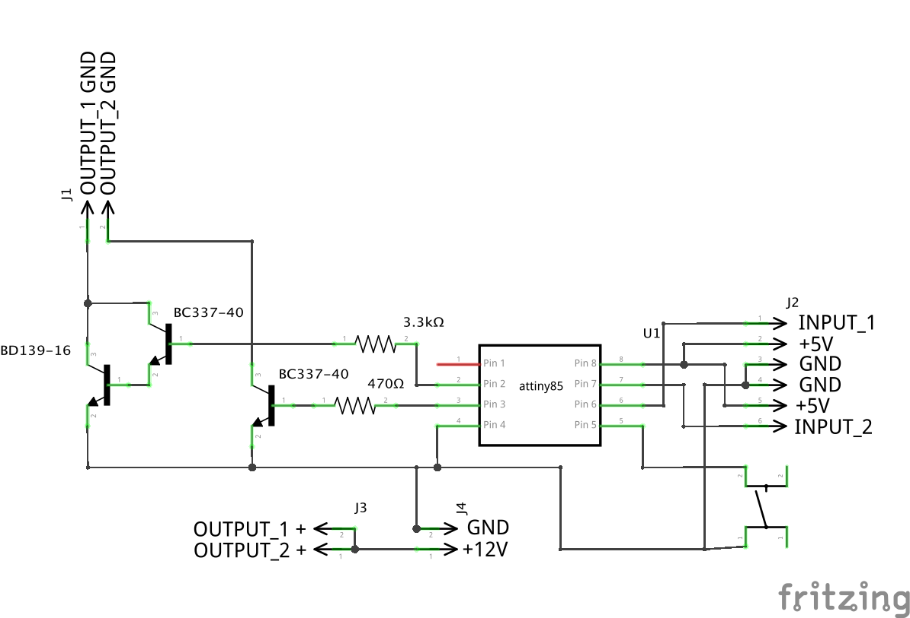
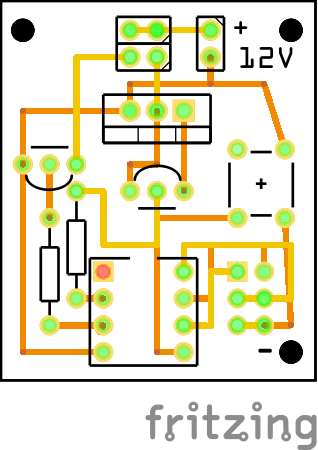

#RC Lights Controller

Lights controller for RC planes, drones, quadcopters driven by RC PWM signal

## Hardware

* ATtiny85 uC
* Transistor BC337-40 or compatible x2
* Transistor BD139-16 or compatible
* 3.3 kOhm resistor
* 470 Ohm resistor
* Some kind of PCB, universal for example
* DuPont 2.54mm male connectors
* TACT switch




PCB files (Gerber format) ready for production are in PCB folder. Test batch ordered from [OSH Park](https://oshpark.com/) was perfect, ready to solder!

### Programming ATtiny85

* Arduino IDE 1.6.6. Should work on older releases, but never tested
* ATtiny45/85 board definitions. Tested with [damellis/attiny](https://github.com/damellis/attiny)
* Uses 8MHz internal osciallator 
* You will need ISP programmer to program ATtiny. I use USBasp. Works perfectly under Linux, Windows and Mac OS X.
* Tutorial how to flash ATtiny can be found [here](https://quadmeup.shtr.eu/programming-attiny85-and-attiny45-with-arduino-ide/)

##Input modes

***RC Lights Controller*** can work in following modes:

* ***No RC input*** - in this mode, light pattern is set by pressing a button. There are 6 preprogrammed patterns that can be used without PWM input. Selected mode is stored in EEPROM memory and will be automatically selected on next power up,
* ***Single RC PWM input*** - in this mode, lights pattern is determined by RC signal on INPUT_1. 2 and 3 position switches are supported. By default:
    * with 2 position switch *RC Lights Controller* works like on-off switch for OUTPUT_1. OUTPUT_2 is not used
    * with 3 position switch, OUTPUT_1 works as: OFF, BLINK, ON. OUTPUT_2 is not used  
* ***Two RC inputs*** - in this mode, total of 9 light modes can be selected using two 3 position switches. Two 2 position switches allows to choose one from 4 light modes. By default:
    * ***INPUT_1*** works like master switch providing the same "modes" like in ***Single RC PWM Input***
    * ***INPUT_2*** works like subprogram selector 
    * ***OUTPUT_2*** is enabled only when ***INPUT_1*** is in ***HIGH*** state
    
##Output Modes

Those are default values. They can be modified in code using _patterns_ array. Each number in this array represents cycle number in which output channes should change: from LOW to HIGH, or from HIGH to LOW. Cycle takes 100ms. So, combination of: ```{10, 20, 30, 40, 50, 60, 70, 80}``` means: turn channel ON on cycle 10, turn it OFF on cycle 20, turn it ON on cycle 30 and so on.  

##Output max load

* OUTPUT_1
    * This is high current output that should work up 1A of load. Remember that power transistor will heat up, so at one point it will require an radiator,
    * On 12V and 400mA power it is already 4.8W load, and max for this transistor is 8W. Be careful 
    * In theory this output can handle up to 80V, but I recommend not to go above 25V. This is already 6S battery, you really need more? 
* OUTPUT_2
    * This is low current output that should not be used above 250mA of load.
    * In theory it can accept up to 45V, but it was rather designed to use buzzer or something with similar requirements. So 12V is a real - life limit here 

### OUTPUT_1
    
|                     | INPUT_2 LOW or not connected  | INPUT_2 MID   | INPUT_2 HIGH  | 
|---                  |---                            |---            |---            |
| ***INPUT_1 LOW***   | OFF                           | OFF           | OFF           |
| ***INPUT_1 MID***   | BLINK 1                       | BLINK 2       | BLINK 3       |
| ***INPUT_1 HIGH***  | ON                            | ON            | OFF           |

### OUTPUT_2

|                     | INPUT_2 LOW or not connected  | INPUT_2 MID   | INPUT_2 HIGH  | 
|---                  |---                            |---            |---            |
| ***INPUT_1 LOW***   | OFF                           | OFF           | OFF           |
| ***INPUT_1 MID***   | OFF                           | OFF           | OFF           |
| ***INPUT_1 HIGH***  | ON                            | OFF           | ON            |